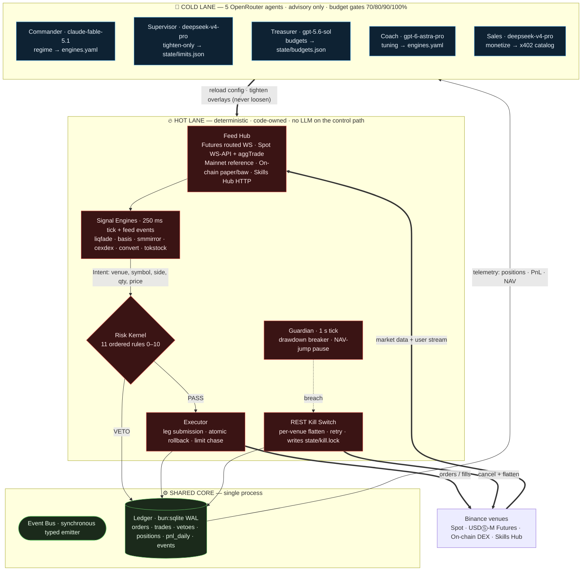
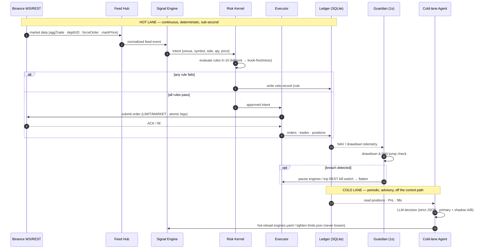

# HYDRA: Two-Speed Autonomous Scalping System on Binance Agent OS

HYDRA is a Bun/TypeScript trading system for the Binance Agent OS Mini Hackathon. A deterministic hot lane handles market data, signals, risk checks and execution; five OpenRouter agents manage bounded strategy configuration, risk overlays, budgets, reports and signal pricing. Demo/testnet and paper paths are separate from real-money operation.

**Verification status:** implementation is under integration and safety review. Local paper execution and mock payments do not prove Binance order latency or on-chain settlement. Credential-backed venue drills, the six-hour soak, cross-platform checks and publication remain acceptance gates; see [the plan](plans/260906-1650-hydra-agent-os/plan.md) and [evidence instructions](docs/evidence/README.md). Do not treat this repository as cleared for live trading.

## Agent OS Components

| Component | demo | live | Where in code |
|---|---|---|---|
| Exchange REST + WS | Futures demo (`demo-fapi.binance.com`, `demo-fstream.binance.com`) + Spot testnet (`testnet.binance.vision`, `ws-api.testnet.binance.vision`) | Binance Mainnet (`fapi.binance.com`, `fstream.binance.com`, `api.binance.com/api`, `ws-api.binance.com/ws-api/v3`) | `src/venues/binance/urls.ts`, `src/venues/binance/rest-futures.ts`, `src/venues/binance/rest-spot.ts`, `src/venues/binance/ws.ts`, `src/venues/binance/userdata.ts` |
| Skills Hub Public HTTP | Real public API calls (Token Audit, Token Info, Leaderboard, RWA Stock Detail) | Real public API calls (Token Audit, Token Info, Leaderboard, RWA Stock Detail) | `src/venues/onchain/skills-http.ts` |
| Agentic Wallet `baw` | Paper on-chain adapter (`PaperAdapter`), mock fills | Pinned `@binance/agentic-wallet` binary (`BawAdapter` via `BAW_BIN`, `>= 1.9.0`) | `src/venues/onchain/adapter.ts`, `src/venues/onchain/baw-adapter.ts` |
| x402 Seller | Mock facilitator (local EIP-712 signature verification, nonce memory, fake tx hash) | B402 facilitator (`/papi/v2/b402/{verify,settle}` on BSC) or Coinbase CDP facilitator (Base mainnet) | `src/pay/server.ts`, `src/pay/facilitator.ts`, `src/pay/catalog.ts` |
| x402 Buyer | `LocalSigner` using demo private key (`X402_DEMO_PRIVATE_KEY` or throwaway) | `BawSigner` delegating signing to paired Agentic Wallet (`baw`) | `src/pay/client.ts` |
| Binance MCP | Disabled by default (`MCP=off`); no mock OAuth success | StreamableHTTP + OAuth bridge (`MCP=on`), with separately documented `claude -p` showcase fallback | `src/cold/mcp/client.ts`, `src/cold/mcp/oauth.ts`, `src/cold/mcp/store.ts` |
| `square-post` | Draft file output only | Draft file output only | `src/cold/agents/sales.ts` |

## Two-Speed Architecture

Both lanes share one process. Code-enforced permissions keep model outputs off the order-submission and kill-lock control paths; this is a logical boundary, not OS process isolation.



### In-Memory Bus and Persistent Ledger
- **Event Bus (`src/core/bus.ts`):** Lightweight synchronous typed event emitter connecting feed events, engine intents, kernel verdicts, execution fills, risk breaches, and kill commands across the process.
- **Ledger (`src/core/ledger.ts`):** High-performance `bun:sqlite` database with WAL mode enabled. Critical trading events (`orders`, `trades`, `vetoes`, `payments`) write through immediately; background telemetry (`llm_calls`, `agent_runs`, `events`, `ab_metrics`) batches safely. A separate read-only SQLite connection serves the dashboard without contention.

### Module Lifecycle Order
Modules initialize and terminate in strict dependency waves:
- **Startup Order:** `feed` -> `userdata` (fill recovery & user socket) -> `executor` (kernel, guardian, boot recovery) -> `engines` -> `agents` + `x402`.
- **Shutdown Order:** Exactly reversed: `agents` + `x402` -> `engines` -> `executor` -> `userdata` + `feed` -> `ledger`.

## End-to-End Run Flow

One complete lifecycle of a trade — from a Binance market event to a hot-lane order and the periodic cold-lane advisory loop that reshapes strategy — with every safety gate on the path.



## Safety Model

HYDRA is constructed under the premise that safety logic must be strictly code-owned, deterministic, and impervious to LLM hallucination, context corruption, or API credit exhaustion.

### Risk Kernel Rules (0–10)
Every trading intent must pass an ordered array of eleven deterministic checks in `src/hot/kernel.ts`. Evaluation stops at the first failure, returning an immutable veto record:

| Rule | Name | Check Description |
|---|---|---|
| **0** | `kill_lock` | Re-reads `state/kill.lock` (cached maximum 250 ms). Vetoes immediately if lock exists. |
| **1** | `engine_active` | Verifies target engine is enabled in `engines.yaml`, not paused in `state/limits.json`, and effective size cap > $0. |
| **2** | `symbol_whitelisted` | Verifies target symbol exists in code-owned `config/risk.yaml` `allowed_symbols` for that venue. |
| **3** | `rate_limit` | Token bucket check against `max_orders_per_sec`. Consumes 1 token per intent leg; refunds on veto. |
| **4** | `notional_cap` | Post-trade intent notional must not exceed remaining engine budget or size limit. Exposure-reducing legs exempt. |
| **5** | `net_delta` | Post-trade total portfolio net delta must remain within `NAV * max_net_delta_pct / 100`. Delta-reducing legs exempt. |
| **6** | `max_leverage` | Post-trade gross futures leverage must not exceed `max_leverage` against effective NAV. Exposure-reducing legs exempt. |
| **7** | `liq_distance` | Post-trade estimated liquidation price distance must remain $\ge$ `min_liq_distance_pct`. |
| **8** | `drawdown_limit` | Daily portfolio drawdown must remain strictly below `daily_drawdown_kill_pct`. |
| **9** | `onchain_audit` | On-chain (DEX) intents require fresh `PASS` audit from Skills Hub within `audit_ttl_sec` and remain under `onchain_max_notional_usd`. |
| **10** | `book_freshness` | `LIMIT` orders require orderbook synchronization flag active and book age $< 2000\text{ ms}$. |

### Code-Owned Guardian
Running on an autonomous 1-second interval (`src/hot/guardian.ts`), the Guardian monitors portfolio health independently of engine execution or LLM availability:
- **Drawdown Breaker:** If portfolio drawdown reaches or exceeds `daily_drawdown_kill_pct` (default 4.0%), the Guardian emits `guardian.breach` and initiates the REST kill switch.
- **NAV Jump Anomaly Breaker:** If $| \Delta\text{NAV} | > \text{nav\_jump\_alert\_pct}$ (default 10.0%) within any 60-second rolling window, all trading engines are immediately paused in `state/limits.json` under actor `guardian` and an emergency alert is broadcast.

### REST Kill Switch with Per-Venue Retry Flattening
The kill switch (`src/hot/kill.ts`) bypasses the normal executor and throttles entirely, operating directly via venue REST clients:
1. Atomically writes `state/kill.lock` with execution timestamp, reason, and initial residue state.
2. Emits `system.kill` across the bus.
3. Loops across all venues until flat:
   - **Futures:** Cancels all open orders; issues reduce-only `MARKET` orders against active `positionRisk` entries.
   - **Spot:** Cancels all open spot orders; sells engine-attributed base assets (or all non-quote assets if `KILL_FLATTEN_ALL_SPOT=1`) via market orders.
   - **On-Chain:** Submits market swaps reversing outstanding DEX balances.
4. Calculates remaining position residue per venue. If any venue fails to flatten, backoff retries (500 ms doubling up to 10,000 ms) continue until verified flat or manually aborted.
5. Sends alerts via Telegram bot or webhook if verification fails beyond `kill_verify_attempts_before_alert` passes.

### Administrative Invariants
- **`kill.lock` Human Clearance:** Once set, `state/kill.lock` can **never** be removed by an agent or automated script. Only an operator invoking `bun run cli unkill` can inspect the venues, confirm zero residue, and delete the lock file.
- **Tighten-Only Risk Overlay:** The cold-lane Supervisor agent can only write to `state/limits.json` to make risk parameters stricter than `config/risk.yaml`. Attempts to loosen limits, increase caps, or raise drawdown thresholds are rejected by `src/core/limits.ts`.
- **Code-Owned Configuration:** `config/risk.yaml` and symbol whitelists (`allowed_symbols`) are file-owned. LLMs have no tools to edit them.
- **No Automated Fund Transfers:** The Treasurer agent only allocates internal operational budgets in `state/budgets.json`. It possesses no capability to initiate external blockchain transactions or Binance API balance transfers.
- **Real-Money Safety Gate:** Running in `live` mode strictly requires setting `HYDRA_I_UNDERSTAND_REAL_MONEY=1`. During initialization, HYDRA verifies API key permissions to ensure withdrawal and universal transfer scopes are disabled.

## Per-Agent Model & Shadow A/B

Each agent in the cold lane operates under independent model configurations specified in `config/agents.yaml`:

```yaml
agents:
  commander:
    model: anthropic/claude-fable-5.1
    shadow_model: openai/gpt-5.6-sol
    interval: 5m
    temperature: 0.2
    fallback_models: [deepseek/deepseek-v4-pro]
    provider: { require_parameters: true, allow_fallbacks: true }
  supervisor:
    model: deepseek/deepseek-v4-pro
    interval: 1m
    temperature: 0.0
  treasurer:
    model: openai/gpt-5.6-sol
    interval: 15m
    temperature: 0.1
  coach:
    model: openai/gpt-6-astra-pro
    cron: "0 0 * * *"
    temperature: 0.4
  sales:
    model: deepseek/deepseek-v4-pro
    interval: 30m
    temperature: 0.5
```

### Environment Overrides & Settings Panel
- **Environment Overrides:** Individual agent models can be overridden at startup using `HYDRA_MODEL_<AGENT>` (e.g. `HYDRA_MODEL_COMMANDER=anthropic/claude-fable-5.1`).
- **Runtime Hot-Reload:** The operator can modify models, shadow models, temperature, intervals, and fallback lists at runtime via the dashboard Settings panel (`PUT /api/config/agents`). Changes write to disk and reload without restarting the process.
- **LLM Daily Budget Gates:** The cold-lane scheduler tracks daily LLM expenditure against `llm_daily_budget_usd` and enforces graceful shedding:
  - At **70%** budget: Shadow models are disabled.
  - At **80%** budget: Coach and Sales agents are paused.
  - At **90%** budget: Treasurer agent is paused.
  - At **100%** budget: Commander agent is paused.
  - **Supervisor is never gated**, ensuring safety oversight persists.

### Shadow A/B Testing
When an agent configures `shadow_model`, the scheduler dispatches identical prompt context to both the primary and shadow models in parallel:
- The primary model's tool calls and decisions are applied to the runtime.
- The shadow model's responses are executed in dry-run mode and recorded in `agent_runs(role='shadow')`.
- Telemetry tracks four distinct metric families over 1-day, 7-day, and 30-day windows:
  1. **Cost & Latency:** Prompt/completion token consumption, dollar cost, and roundtrip execution latency.
  2. **Reliability:** Schema validation rate and tool parameter rejection rate.
  3. **Agreement Rate:** Percentage of decisions where shadow recommendations matched the primary model.
  4. **Attributed PnL (1 hour):** Realized engine PnL attributed 60 minutes after the primary decision was recorded.
- The operator can promote any shadow model to primary directly from the dashboard (`POST /api/config/agents/:agent/promote-shadow`).

## Modes and Environment Matrix

HYDRA derives venue configurations automatically from `HYDRA_MODE`, but allows granular overrides:

| Flag | Values | Default in `demo` | Default in `live` | Description |
|---|---|---|---|---|
| `HYDRA_MODE` | `demo`, `live` | `demo` | — | Top-level runtime operational mode |
| `HYDRA_I_UNDERSTAND_REAL_MONEY` | `0`, `1` | `0` | `1` (required) | Mandatory confirmation flag for any live venue |
| `SPOT` | `testnet`, `live` | `testnet` | `live` | Binance Spot execution environment |
| `FUTURES` | `demo`, `live` | `demo` | `live` | Binance Futures execution environment |
| `ONCHAIN` | `paper`, `live` | `paper` | `live` | DEX execution mode (paper mock vs live `baw` binary) |
| `X402` | `mock`, `b402`, `cdp` | `mock` | `b402` | Facilitator implementation for x402 payment settlement |
| `MCP` | `off`, `on` | `off` | `off` | Binance Model Context Protocol bridge |

### Environment Variables

| Variable | Description |
|---|---|
| `BINANCE_SPOT_API_KEY` | Binance Spot API Key (optional in demo; required in live spot) |
| `BINANCE_SPOT_API_SECRET` | Binance Spot API Secret HMAC |
| `BINANCE_FUTURES_API_KEY` | Binance Futures Demo/Live API Key |
| `BINANCE_FUTURES_API_SECRET` | Binance Futures Demo/Live API Secret HMAC |
| `DASHBOARD_TOKEN` | Operator token for the local dashboard (full control). Must be >= 24 characters; required in live, auto-generated and printed once in demo if unset |
| `DASHBOARD_VIEWER_TOKEN` | Optional viewer token: read-only role (GET + live stream, no logs, no writes) for presentations or screen-share. >= 24 characters and different from `DASHBOARD_TOKEN` |
| `DASHBOARD_PORT` | Local dashboard HTTP/WebSocket port (default `8787`) |
| `X402_PORT` | Dedicated public port for x402 signal monetization (default `8788`) |
| `X402_DEMO_PRIVATE_KEY` | Hex private key for demo x402 buyer signature generation |
| `YESCALE_API_KEY` | YEScale AI Gateway API authentication key for cold-lane LLM agents |
| `YESCALE_MCP_KEY` | YEScale MCP User Access Key for control plane & quota management (optional) |
| `LLM_BASE_URL` | Gateway base URL (default `https://api.yescale.io/v1`) |
| `TELEGRAM_BOT_TOKEN` | Telegram Bot API token for dispatching high-priority safety alerts |
| `TELEGRAM_CHAT_ID` | Telegram chat identifier receiving safety alerts |
| `ALERT_WEBHOOK_URL` | Generic HTTP POST fallback endpoint for alerting |
| `BAW_BIN` | Absolute filesystem path to verified `@binance/agentic-wallet` binary |
| `KILL_FLATTEN_ALL_SPOT` | If `1`, kill switch liquidates all non-quote spot assets, not only engine-attributed ones |
| `REPLAY_SPEED` | Playback rate multiplier for `cli replay` (default `1`) |
| `SKILLS_HTTP` | Base URL for Binance Skills Hub endpoints (default `https://web3.binance.com`) |

## Quick Start

### 1. Installation
Ensure [Bun](https://bun.sh) (v1.1+) is installed on your system:

```bash
git clone https://github.com/Suharaz/hydra-agent-os.git
cd hydra-agent-os
bun install
```

### 2. Environment Configuration
Copy the example environment configuration:

```bash
cp .env.example .env
```

*Note: In `demo` mode, all external API keys are optional. If `DASHBOARD_TOKEN` is left empty, HYDRA generates a secure random token at startup and prints it to stdout.*

### 3. Preflight Verification
Verify that your local environment, configuration schemas, and ledger initialize cleanly:

```bash
bun run hydra --mode demo --check
```

### 4. Boot HYDRA Runtime
Start the full two-speed system:

```bash
bun run hydra --mode demo
```

Upon boot, the console displays the active venue matrix, server listening ports, and the dashboard access token:

```
HYDRA mode=demo
  venue     flag      real-money
  spot      testnet   no
  futures   demo      no
  onchain   paper     no
  x402      mock      no
  mcp       off       no

dashboard listening {"hostname":"127.0.0.1","port":8787,"url":"http://127.0.0.1:8787/"}
x402 seller listening on port 8788
```

Open `http://127.0.0.1:8787` in your browser and paste the token into the login form. The token never travels in the URL; the browser receives an `HttpOnly` session cookie (see [Security model](#security-model)).

### 5. Execute Scripted End-to-End Scenarios
In a separate terminal, test system capabilities across the six automated demonstration scenarios:

```bash
# Scenario 1: Liquidation fade replay -> Intent -> Risk Kernel -> Order ACK + latency
bun run cli scenario 1

# Scenario 2: Cold-lane Commander regime adjustment -> engines.yaml diff
bun run cli scenario 2

# Scenario 3: Supervisor risk tightening -> Guardian kill breaker -> per-venue flatten -> unkill
bun run cli scenario 3

# Scenario 4: Smart-money mirror with live Skills Hub token security audit FAIL -> Veto
bun run cli scenario 4

# Scenario 5: External agent pays for signal feed over x402 protocol (mock facilitator)
bun run cli scenario 5

# Scenario 6: Binance Model Context Protocol tools/list inspection
bun run cli scenario 6
```

## Command Line Interface (CLI)

The `bun run cli` tool provides direct operational and diagnostic commands:

| Command | Description |
|---|---|
| `bun run cli intent <engine> <venue> <symbol> <side> <qty> [opts]` | Submits a single manual order intent directly through the Risk Kernel and Executor |
| `bun run cli kill [reason]` | Manually trips the REST kill switch: cancels all open orders, flattens all venues, and writes `state/kill.lock` |
| `bun run cli unkill` | Operator command: verifies zero exposure residue across all venues, then removes `state/kill.lock` |
| `bun run cli promote <engine>` | Operator command: promotes an engine from paper trading to live order routing |
| `bun run cli replay <fixture.ndjson>` | Replays historical recorded market data through Feed Hub and tallies emitted event counts |
| `bun run cli agent run <name> [--no-shadow]` | Forces an immediate execution cycle for a specified cold-lane agent |
| `bun run cli mcp list` | Lists all available tools from the Binance MCP bridge and displays read-only permissions |
| `bun run cli mcp call <tool> [json-args]` | Invokes a whitelisted read-only tool via the Binance MCP bridge |
| `bun run cli buy <path> [--max-usd n]` | Simulates an external client purchasing a signal from the local x402 seller using `LocalSigner` |
| `bun run cli baw pair` | Initiates terminal QR-code pairing flow for the pinned `@binance/agentic-wallet` binary |
| `bun run cli scenario <1..6> [--live]` | Executes scripted end-to-end integration and verification scenarios |
| `bun run cli audit [--tail N] [--since ISO-8601]` | Prints the `dashboard_audit` ledger table (who did what, when) over a read-only connection; default tail 50 |
| `bun run cli help` | Displays command syntax and available subcommands |

## Dashboard Architecture

The operator dashboard is served on `127.0.0.1:8787` (`src/dashboard/server.ts`). Telemetry snapshots stream to connected clients every 250 ms over WebSocket.

### Security model

The dashboard is a loopback-only control surface. Every control below is enforced in code, not configuration; nothing in `.env` can widen it.

**Threat model**

| Attacker | Attack | Control |
|---|---|---|
| Local attacker with a browser | Token theft from a URL, history, or `localStorage` | Credentials never appear in a URL or web storage. Login is `POST /api/login`; the session is an `HttpOnly` cookie the page's JavaScript cannot read. WebSocket auth uses one-time tickets, never the token |
| Local attacker with a browser | XSS via an injected script | `Content-Security-Policy` pins `script-src` to the SHA-256 of the page's single inline script; no `'unsafe-inline'`, no inline event handlers |
| Local attacker with a browser | Clickjacking the KILL or Settings controls | `X-Frame-Options: DENY` and `frame-ancestors 'none'`; `SameSite=Strict` cookie so no cross-site request carries the session |
| Local malicious process | Brute-forcing the token over loopback | Global lockout: 5 failed authentications within 60 s answer `429` (`Retry-After: 60`) for 60 s, including correct guesses; one alert on entering lockout; a `dashboard_audit.lockout` row |
| Local malicious process | Session or ticket reuse | Sessions expire after 12 h idle / 24 h absolute; `POST /api/sessions/revoke-all`; restart revokes everything. WS tickets are single-use and expire in 30 s |
| Remote attacker | Anything | Nothing reachable: `createDashboard` throws unless the bind host is loopback (`127.0.0.1`, `localhost`, `::1`) and the Origin check pins `127.0.0.1:<port>` |
| Operator mistake | Weak token | Both tokens must be >= 24 characters and differ from each other. Live refuses to boot on a short or missing `DASHBOARD_TOKEN`; demo generates one when absent and warns when short |
| Operator mistake | Fake or accidental kill | `POST /api/kill` requires `{confirm:"KILL"}` and the operator role; the demo page either calls the real endpoint or shows a persistent `SIMULATION` badge. Unkill is CLI-only |

**Tokens and roles**

- `DASHBOARD_TOKEN` logs in as **operator**: every GET, the live stream, and every write endpoint.
- `DASHBOARD_VIEWER_TOKEN` (optional) logs in as **viewer**: GET endpoints and the live stream only; snapshots omit `logs`; every write answers `403 {"error":"operator role required"}`. Meant for presentations and screen-share.
- `GET /api/session` returns `{role, mode}` for the current cookie so a refresh never re-prompts; `POST /api/logout` clears it.

**Sessions and transport**

- Session cookie `hydra_session`: `HttpOnly; SameSite=Strict; Path=/`; 12 h idle timeout, 24 h absolute lifetime; held in process memory, so a restart revokes all sessions. `POST /api/sessions/revoke-all` (operator) revokes every session including the caller's.
- WebSocket: `POST /api/ws-ticket` returns a single-use ticket valid for 30 s; the client connects to `/ws?ticket=...`. One ticket in flight per session; issuing a new one invalidates the previous.
- Lockout: 5 failed authentications (wrong bearer, wrong login token, bad or expired ticket) within 60 s lock every auth path for 60 s with `429` and `Retry-After`; one `warn` alert is sent when the lock engages.
- Caps: request bodies on `/api/*` are limited to 64 KB (`413` above); at most 8 concurrent WebSocket clients (`503` for the 9th).
- Response headers on every route: `Content-Security-Policy` (script hash, `default-src 'none'`, `connect-src 'self'`, `frame-ancestors 'none'`), `X-Frame-Options: DENY`, `X-Content-Type-Options: nosniff`, `Referrer-Policy: no-referrer`; API responses add `Cache-Control: no-store`.

**Audit trail**

Every login, logout, lockout, revoke-all, failed auth, and mutation (`agents_put`, `budgets_put`, `promote_shadow`, `kill`, `dream_run`) is written through to the `dashboard_audit` ledger table with the first 8 characters of the session id, the role, the HTTP status, and a JSON detail (request digest and result summary; never the token). Config writes made from the dashboard record `config_changes.actor = operator:<session8>`, so the two tables join on the session. Read it with `GET /api/audit?limit=50&since=<epoch ms>` (operator), the dashboard Audit panel, or from the shell while HYDRA is running:

```bash
bun run cli audit --tail 50
bun run cli audit --since 2026-09-08T00:00:00Z
```

**Remote access**

The only supported remote path is an SSH port-forward. On your workstation:

```bash
ssh -N -L 8787:127.0.0.1:8787 user@vps
```

then open `http://127.0.0.1:8787/` locally. The browser's Origin stays `127.0.0.1:8787`, the server still binds loopback, and no code path is loosened.

Explicitly **unsupported** by design: binding `0.0.0.0` or any non-loopback address (`createDashboard` throws `DashboardBindError`), cloudflared/ngrok tunnels, and reverse proxies. Reasons: the dashboard speaks plaintext HTTP with no in-process TLS, the Origin check is pinned to the loopback host and port, and the session cookie is designed for a single local browser. A tunnel that 403s on Origin is working as intended; do not "fix" it by widening the check.

**Runbook**

| Situation | Action |
|---|---|
| Lost or leaked token | Rotate `DASHBOARD_TOKEN` (and `DASHBOARD_VIEWER_TOKEN`) in `.env`, restart HYDRA; the restart revokes every session |
| Suspected session theft | `POST /api/sessions/revoke-all` with the operator session, or restart HYDRA; then read `bun run cli audit` for what the session did |
| Locked out (`429`) | Wait 60 s and retry. If the system must be flat now, run `bun run cli kill <reason>` from the shell: the kill switch never depends on the dashboard |

### Ten Operational Panels
1. **Venues & Latency:** Real-time venue status, real-money badges, 24-hour order throughput, and p50/p95 order execution latency.
2. **Books, Marks & Tape:** Live L2 book depths, mark prices, funding rates, tick spreads, and synchronized cross-venue event tape.
3. **Engines:** Status table for the six engines showing active parameters, contracts, 24-hour PnL, hit rate, and trade counters.
4. **Kernel, Guardian & Log:** Live stream of Risk Kernel veto records (with rule numbers and reasons) and color-coded system event logs.
5. **Agents Timeline:** Real-time feed of cold-lane executions displaying agent name, role (primary vs shadow), model ID, cost in USD, runtime latency, schema validity, and tool output.
6. **Positions & Orders:** Open positions across Spot, Futures, and On-Chain venues, unrealized PnL, and live order status. Houses the emergency `KILL` lock banner.
7. **Payments & Spend:** Cumulative LLM and market data expenditures tracked against daily budgets, plus incoming x402 micro-settlement transactions.
8. **Emergency Kill Control:** Visual danger button prompting operator confirmation before triggering `/api/kill`.
9. **Settings:** Dynamic configuration panel to modify agent models, assign shadow models, adjust temperatures, change execution intervals, and modify daily spending budgets without process restarts. Includes a model catalogue selector synced with OpenRouter.
10. **A/B Performance Comparison:** Comparative evaluation table contrasting primary vs shadow models across cost, latency, schema validity, agreement percentage, and 1-hour post-decision PnL attribution.
11. **Audit:** Last 50 `dashboard_audit` rows (session, role, action, status, detail), refreshed every 15 s. Operator only.

### Write Endpoints (Operator Only)
- `PUT /api/config/agents` — Applies partial updates to `config/agents.yaml`.
- `PUT /api/config/budgets` — Updates `llm_daily_budget_usd` and `data_daily_budget_usd` in `config/risk.yaml`.
- `POST /api/config/agents/:agent/promote-shadow` — Promotes an active shadow model to primary.
- `POST /api/kill` — Dispatches emergency liquidation (`confirm="KILL"` required).
- `POST /api/dream/run` — Triggers one cold-lane dream cycle (`confirm="DREAM"` required; `409` while one is running).
- `POST /api/sessions/revoke-all` — Revokes every dashboard session, including the caller's.

*Note: The dashboard exposes no write endpoints capable of altering hard risk caps, editing symbol whitelists, or removing `state/kill.lock`.*

## Operational Runbook

### 1. Handling HTTP 418 / IP Rate Limits
- **Symptom:** Binance REST calls return HTTP 418 or 429 with IP ban notices.
- **Remedy:** Respect `Retry-After`; do not rotate IPs to evade a ban. The kill loop keeps retrying independently of normal executor throttling. If Binance remains unreachable, use the Binance UI to cancel/flatten positions and inspect the alert channel. A local kill request is not proof that the venue is flat.

### 2. Kill Recovery Workflow
When the kill switch is triggered (via Guardian or operator command), the system enters emergency lockdown:
1. Review the trigger reason in `state/kill.lock` or the dashboard notification banner.
2. Inspect `vetoes` and `events` in the SQLite database or dashboard panel 4.
3. Verify that all positions are completely closed and no resting orders remain:
   ```bash
   bun run cli unkill
   ```
4. If position residue remains on any venue, `cli unkill` reports the exact remaining balance and refuses to unlock. Manually settle the balance or rerun `bun run cli kill`.
5. Once all venues report clean zero balances, `cli unkill` removes `state/kill.lock` and normal trading resumes.

### 3. Guardian NAV-Jump Emergency Pause
- **Symptom:** Guardian detects a NAV change above `nav_jump_alert_pct` in [`config/risk.yaml`](config/risk.yaml) within its observation window and pauses engines.
- **Remedy:** Verify account balances, marks and testnet reset status before an operator changes the limits overlay. Never delete `state/kill.lock` directly; use `cli unkill` after reconciliation. Preserve any separate Supervisor tightening when clearing a NAV-jump pause.

### 4. OpenRouter Credit Exhaustion (HTTP 402)
- **Symptom:** Cold-lane LLM calls fail with `LlmError: credits` and emit `system.llm_credits`.
- **Remedy:** The scheduler pauses the cold lane until the next UTC day after a credit error. Guardian and the deterministic hot lane remain independent. Replenish credits and inspect the scheduler state; there is no automatic credit-ping recovery guarantee.

### 5. Spot Testnet Inconsistencies / Resets
- **Symptom:** Spot testnet WebSocket drops connections or rejects signature timestamps.
- **Remedy:** Binance periodically wipes the testnet database. Ensure local system time is synchronized via NTP. If testnet keys expire, regenerate keys at `testnet.binance.vision` and update `.env`.

## Limitations & Unverified Items

In accordance with our engineering and validation standards, the following edge conditions and surfaces are explicitly noted:

- **Binance Agentic Virtual Sub-Account API Keys:** Unverified live API permissions for sub-account automated generation; our architecture deliberately utilizes standard master-issued sub-account API keys with restricted trade-only permissions.
- **Binance MCP Dynamic Client Registration (DCR):** Custom OAuth client dynamic registration remains unverified against live production endpoints; an automated localhost PKCE callback bridge with fallback to standard `claude -p` is implemented.
- **Facilitator credentials:** B402 onboarding and CDP credentials are separate prerequisites. Select `X402=b402` or `X402=cdp` explicitly; missing B402 credentials do not silently select CDP. Live settlement is unverified without a successful transaction receipt.
- **Agentic Wallet on Windows:** native Windows execution is unverified. Linux/WSL is the intended live on-chain environment, but cross-platform acceptance still requires execution evidence.
- **Futures Liquidation Feed Granularity:** The Binance WebSocket `forceOrder` stream broadcasts at a 1-second sampled snapshot rate per symbol rather than continuous tick-level liquidation matching.
- **Known-open safety findings (from the independent hot-lane review; must close before real money):** S09 — futures legs that ACK with zero fill defer TP/SL without a fill-driven placement, and partial fills protect only the initially acked quantity; S13 — kernel rules 1/8 can veto a risk-reducing exit for a paused/disabled engine or during drawdown, `Engine.close()` drops its tracked position before the exit confirms, and live futures exits do not set `reduceOnly`; demo boot without venue keys leaves NAV at 0 so rules 5–7 veto every trade unless a scenario seeds a paper bankroll. Tracked in the plan as GATED/OPEN.

## Roadmap

- [ ] Complete the acceptance evidence in the [implementation plan](plans/260906-1650-hydra-agent-os/plan.md), including real venue safety drills and the six-hour soak.
- [ ] Measure signal-to-ACK latency over at least 30 actual demo-venue orders; report paper measurements separately.
- [ ] Verify Linux/WSL quick start and the paired Agentic Wallet integration.
- [ ] Publish the repository and submission material only after operator approval.

## License

This project is licensed under the [MIT License](LICENSE).
