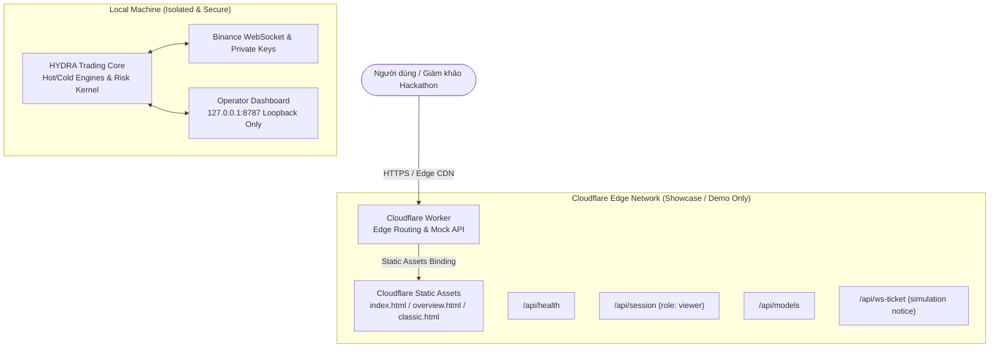

# Kế hoạch triển khai HYDRA Agent OS lên Cloudflare

## 1. Ranh giới Bảo mật & Phạm vi triển khai (Security Invariant)

Theo kế hoạch siết chặt an ninh dashboard (`plans/260908-1449-dashboard-security-hardening`):
1. **Trading Core & Operator Dashboard thực tế CHỈ chạy cục bộ**:
   - Dashboard gắn cứng `127.0.0.1` loopback; `createDashboard({hostname:"0.0.0.0"})` sẽ ném ngoại lệ chặn chạy.
   - Không mở cổng public hay dùng tunnel đưa quyền Operator ra internet để bảo vệ API Key Binance thực tế và tài sản.
2. **Phạm vi triển khai lên Cloudflare**:
   - **Chỉ triển khai Edge Showcase / Demo Simulation**:
     - Giao diện mô phỏng tương tác (`hydra-demo.html` / `dist/index.html`).
     - Trang tổng quan kiến trúc hệ thống (`hydra-overview.html` / `dist/overview.html`).
     - Dashboard cổ điển (`dist/classic.html`).
     - Hono Edge API (`src/worker.ts`): trả về trạng thái node Edge, role `viewer`, mock WS ticket và simulation telemetry an toàn.

---

## 2. Kiến trúc Triển khai (Deployment Architecture)

---

## 3. Thực tế công cụ & Cơ chế Xác thực

- **Hiện trạng MCP trong session hiện tại**:
  - Session hiện tại chỉ được mount **Cloudflare Docs MCP** (`mcp__cloudflare_docs_*`), **chưa có tool thực thi Code Mode API** (`mcp__cloudflare__*`).
  - Gọi trực tiếp `https://mcp.cloudflare.com/mcp` yêu cầu OAuth 2.0 Bearer token (trả về 401 khi không có token).
- **Phương án triển khai**:
  - **Phương án 1 (Khuyên dùng - Nhanh nhất)**: Cung cấp `CLOUDFLARE_API_TOKEN` và `CLOUDFLARE_ACCOUNT_ID` từ tài khoản full quyền $\to$ Agent chạy script `bun run deploy:cf` trực tiếp.
  - **Phương án 2 (OAuth qua Terminal)**: Chạy `bunx wrangler login` hoặc `bun run scripts/wrangler-suhara-login.ts` trên Terminal để nhận quyền từ trình duyệt trong 5 giây.
  - **Phương án 3 (Nếu mount Code Mode MCP)**: Cần thêm/cấp quyền Cloudflare Code Mode MCP vào session, khi đó có thể gọi API trực tiếp. (Lưu ý: triển khai kèm Static Assets qua API thuần đòi hỏi manifest upload hoặc inline HTML vào `worker.ts`).

---

## 4. Các giai đoạn triển khai (Phases)

| Phase | Giai đoạn | Nội dung thực hiện | Trạng thái |
|:---|:---|:---|:---:|
| **Phase 1** | Chuẩn bị & Xác thực | Nhận `API_TOKEN` / `ACCOUNT_ID` hoặc xác thực OAuth qua `wrangler login` | Pending |
| **Phase 2** | Kiểm chứng Bundle | Chạy `bun run build:dist` & `bunx wrangler deploy --dry-run` | Đã đạt (82.83 KiB) |
| **Phase 3** | Triển khai Production | `bun run deploy:cf` (`bunx wrangler deploy`) lên subdomain `*.workers.dev` | Pending |
| **Phase 4** | Kiểm thử Smoke Test | Kiểm tra HTTP 200 cho `/`, `/overview.html`, `/api/health`, `/api/session` | Pending |

---

## 5. Tiêu chí nghiệm thu (Acceptance Criteria)

- [ ] Xác thực thành công: `bunx wrangler whoami` nhận diện account hợp lệ.
- [ ] Gói bundle được tải lên hoàn tất, không lỗi manifest.
- [ ] URL Production live trên mạng toàn cầu của Cloudflare.
- [ ] Mọi request đều ở chế độ mô phỏng / viewer an toàn; không rò rỉ bất kỳ API key Binance hay tài nguyên private nào.
